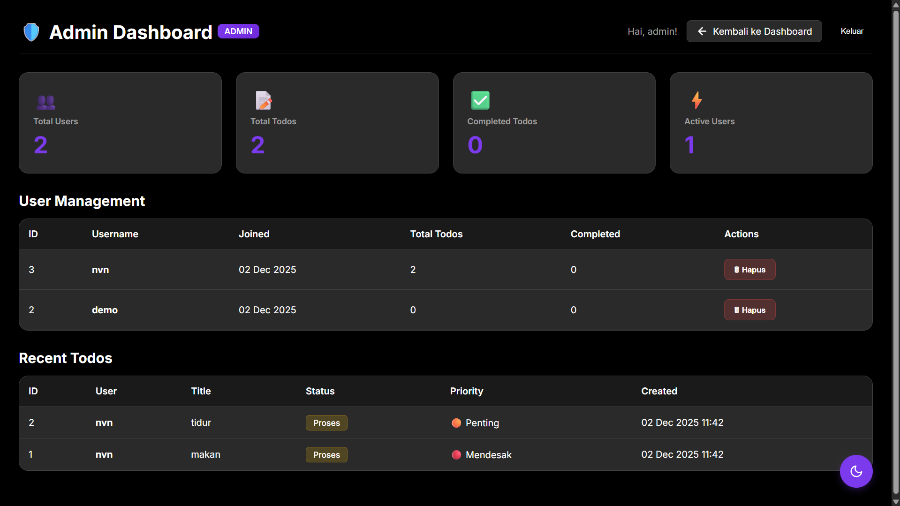
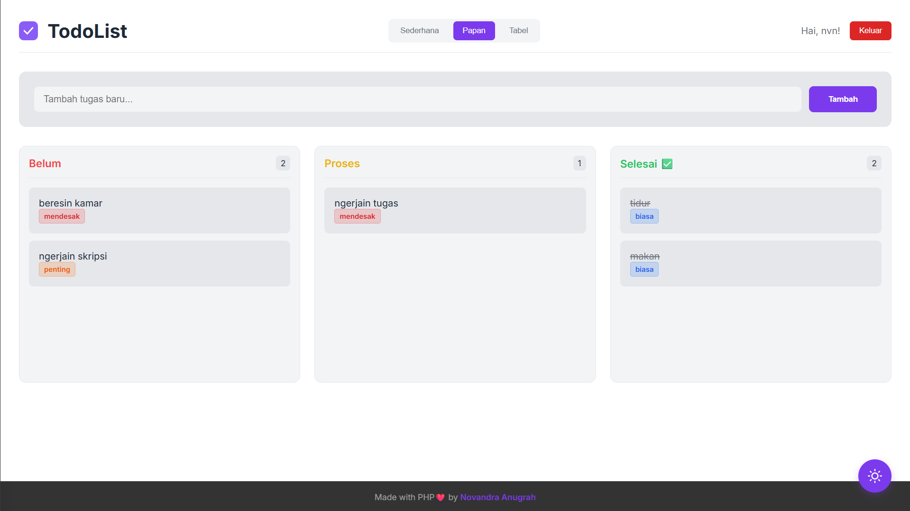
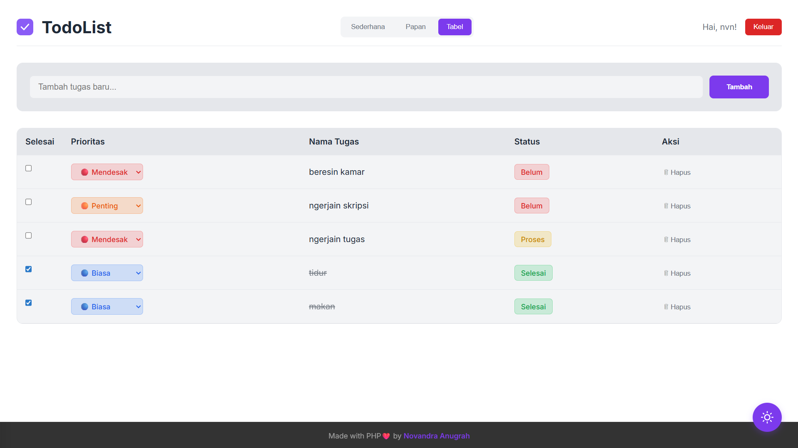
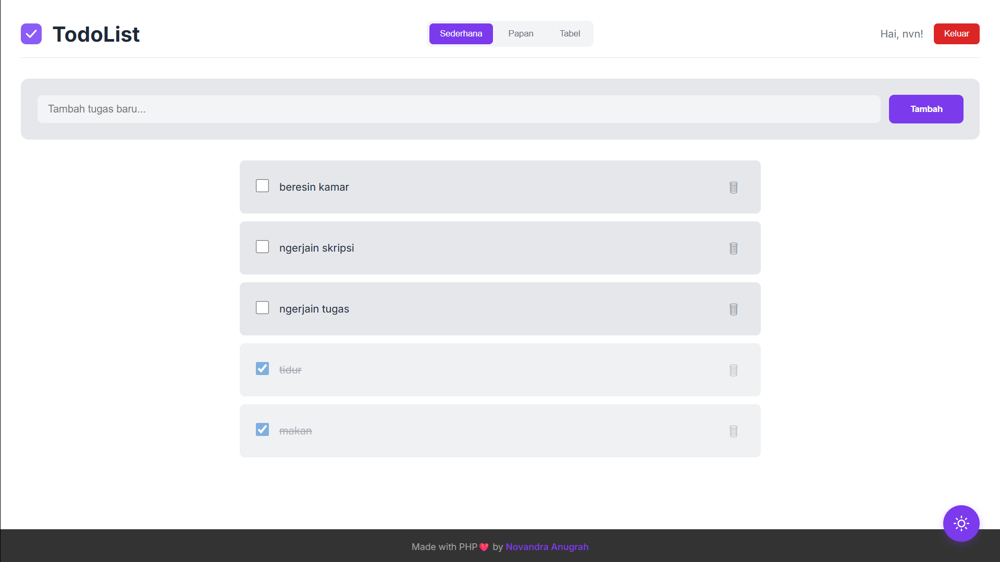

# 📝 TodoList App

Aplikasi todo list modern dengan PHP dan MySQL. Kelola tugasmu dengan mudah!

## ✨ Fitur

- ✅ **3 Tampilan Berbeda**: Sederhana, Papan (Kanban), dan Tabel
- ✅ **Manajemen Todo**: Tambah, edit status, prioritas, dan hapus
- ✅ **Drag & Drop**: Pindahkan todo antar kolom di papan
- ✅ **Dark & Light Mode**: Pilih tema sesuai preferensimu
- ✅ **Admin Dashboard**: Kelola semua user dan lihat statistik
- ✅ **Keamanan**: Password terenkripsi dengan bcrypt

## 🚀 Cara Install

### 1. Import Database

1. Buka **phpMyAdmin**: `http://localhost/phpmyadmin`
2. Klik **"Import"** → Pilih file `database.sql`
3. Klik **"Go"**

### 2. Jalankan XAMPP

- Start **Apache**
- Start **MySQL**

### 3. Buka Aplikasi

Browser: `http://localhost/todo-list/`

## 🔑 Login

**Admin:**
- Username: `admin`
- Password: `TomatoPotato01!`
- Akses: `http://localhost/todo-list/admin.php`

**User Biasa:**
- Daftar dari halaman utama

## 📁 Struktur Database

**Database:** `todolist_db`

**Tabel:**
- `users` - Data user (id, username, password, role)
- `todos` - Data todo (id, user_id, title, status, priority, is_completed)

## 🛠️ Troubleshooting

**Error Koneksi:**
- Pastikan MySQL berjalan di XAMPP
- Cek nama database: `todolist_db`

**Halaman Tidak Ditemukan:**
- Folder harus bernama `todo-list` di dalam `xampp/htdocs/`

---

Made with PHP ❤️ by **Novandra Anugrah**
